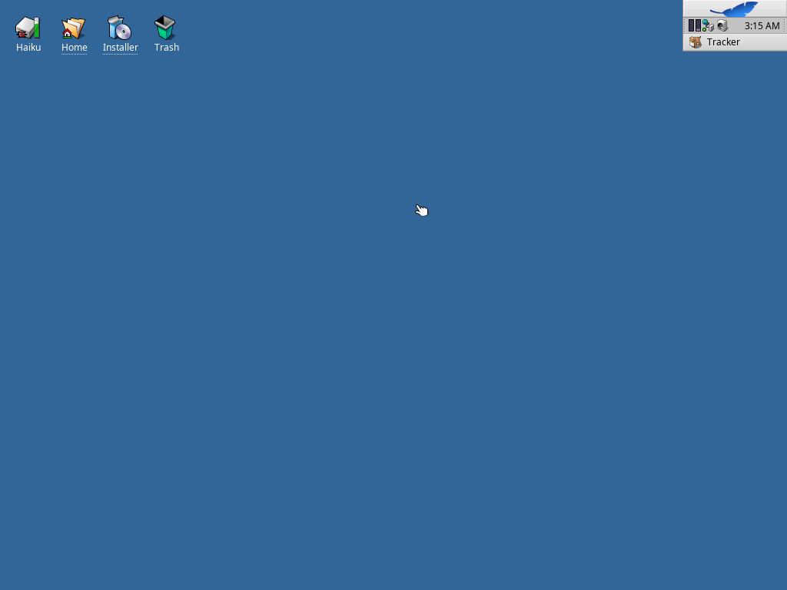
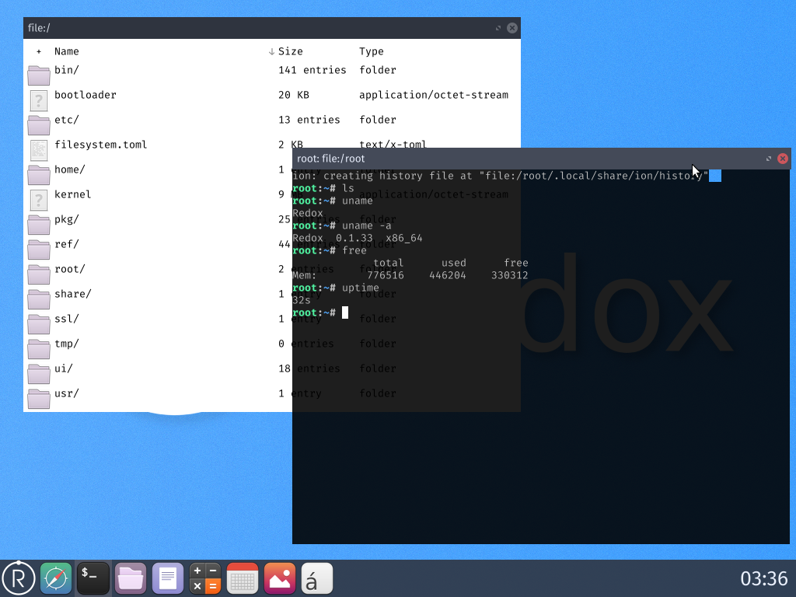
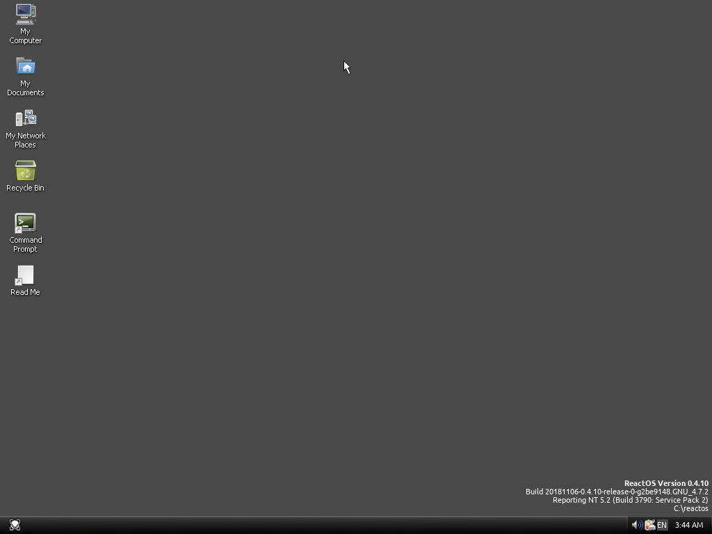
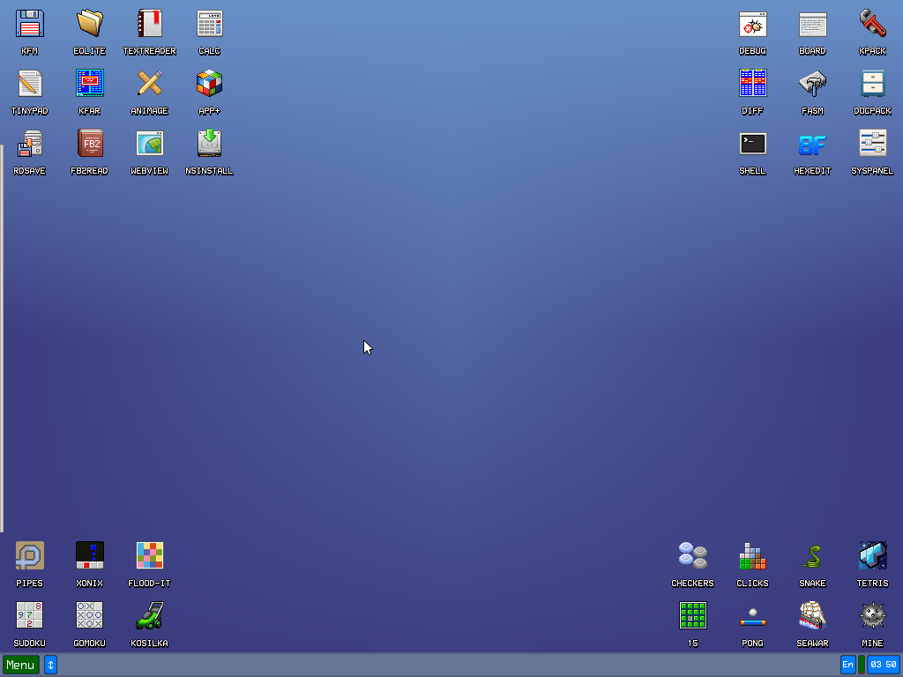
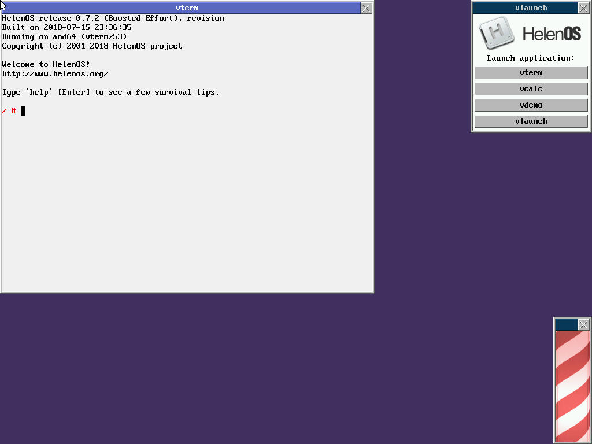
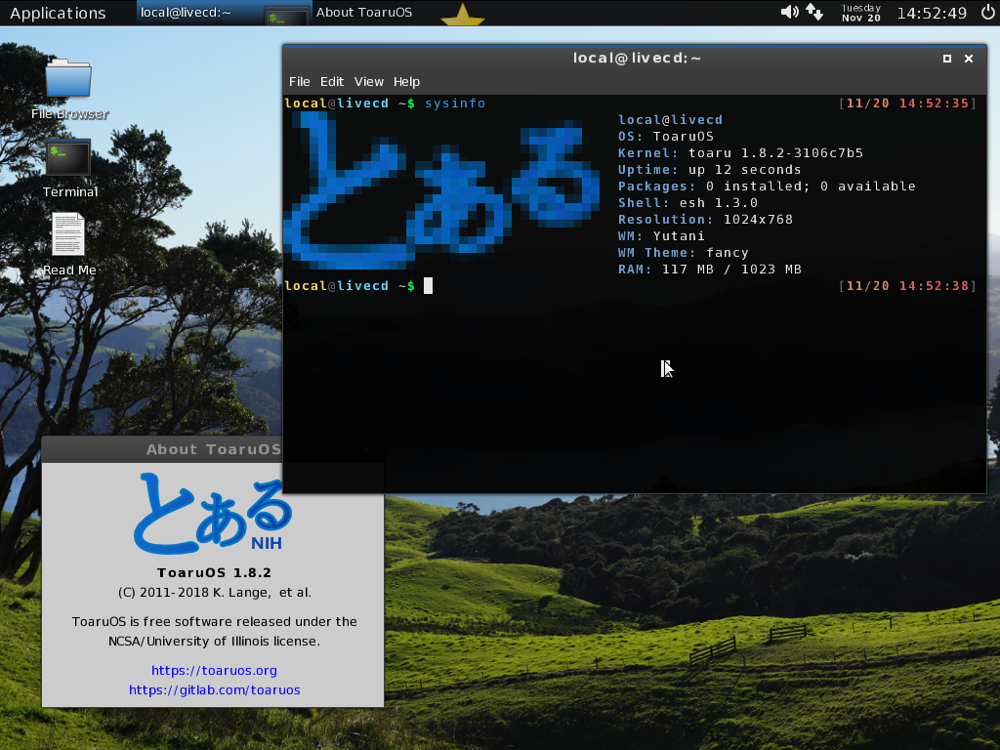
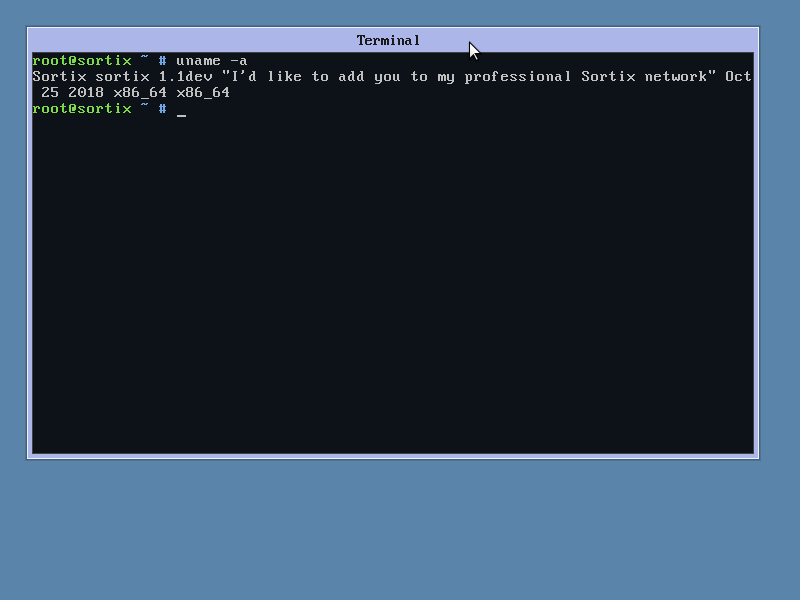

# The Hobby OS Landscape

*A guide to hobbyist operating systems*

| **Project Name** | **Public Repository**               | **Contributors** | **Active Contributors**   (>100 commits) | **Start Date** | Language |
|------------------|-------------------------------------|------------------|---------------------------------------------|----------------|----------|
| Haiku            | https://github.com/haiku/haiku      | 170              | 40                                          | July, 2002     | C++, C   |
| Redox            | https://gitlab.com/redox/redox      | \*               | \*                                          | April, 2015    | Rust     |
| ReactOS          | https://github.com/reactos/reactos  | 116              | 36                                          | January, 1996  | C        |
| KolibriOS        | https://repo.or.cz/w/kolibrios.git  | 49?              | 6?                                          | October, 2005  | Assembly |
| HelenOS          | https://github.com/HelenOS/helenos  | 39               | 15                                          | February, 2005 | C        |
| ToaruOS          | https://github.com/klange/toaruos   | 17               | 1                                           | January, 2011  | C        |
| Sortix           | https://gitlab.com/sortix/sortix    | 16               | 1                                           | August, 2011   | C, C++   |

*Contributor numbers for Redox are hard to calculate as the project is now split across several repositories.*

## What's going to happen with this?

The goal of this document is to provide a comparison and brief overview of a handful of hobby OSes. 

# Projects

## Haiku

Haiku is arguably the most advanced hobby OS that can still reasonably considered a "hobby" project. Started in 2001 and built from a kernel originally written by Travis Geiselbrecht (who would later start the Fuchsia project at Goole), Haiku aims to recreate the experience of BeOS, which had just been discontinued. Haiku boasts a large development team and an impressive final product, with ports of several major applications - including a recent port of LibreOffice. With the rise of 64-bit systems, Haiku has shifted from binary compatibility with BeOS to building their own ABIs with newer compiler toolchains.

Haiku's live CD boots to a simple, unimposing desktop that harkens back to its BeOS roots. Instead of a wide pane at the top or bottom, Haiku's deskbar sits in the upper right corner, as its predecessor did.

## Redox

Redox is a relatively new entry in the hobby OS world - one that caught on quickly. Redox is somewhat unique for being written Rust. While not the only Rust OS out there, Redox was in the right place at the right time to pull in a large team of developers - though the exact number is hard to pin down now that the project has gone from a single repository to an entire ecosystem of distinct parts.

Redox's software support, through a vast Rust ecosystem, is impressive, but its UI feels sluggish and unpolished.

## ReactOS

ReactOS is more research project than hobby OS. A recreation of NT, ReactOS is a sort of extension of the Wine project. Many hobbyists will claim that Windows support is one of their goals, but nothing comes close to ReactOS on delivering with that promise. ReactOS feels a lot like using Windows 2000 - intentionally. ReactOS is also the longest-running project on this list, which can be partially attributed to a goal that forces it to remain a hobby project.

In addition to the classic Windows theme, ReactOS also comes with an alternative "Visual Style". Unfortunately, I couldn't get wallpapers to work from the live CD. It would be really nice if they included Firefox on the CD...

## KolibriOS

When some people think hobby operating systems and systems programming in general, they think of assembly. Kolibri is a fork of the older Menuet, the latter having gone closed-source for its 64-bit release. Kolibri comes with a plethora of native applications, also written in x86 assembly.

The dozens of icons on the desktop show off KolibriOS's large assortment of native software.

## HelenOS

HelenOS is a multi-server microkernel OS with around a dozen active contributors. It's been the subject of academic research and is used by a few university programs to teach systems design.

HelenOS is technically impressive underneath, but doesn't have much to show for end-users.

## ToaruOS

ToaruOS is my own project, mostly a one-man effort. ToaruOS used to have an extensive Python desktop environment and several ports, but an effort to get rid of Newlib and build an OS entirely from scratch has led to some changes in the available software. Still, we have a port of GCC and Python 3 running atop our own ecosystem, including a robust window compositor, terminal emulator, and an increasing number of native applications.

ToaruOS's UI is meant to replicate the look and feel of a modern desktop, though the native font rasterizer can be a bit messy.

## Sortix

Sortix aims to be a clean implementation of POSIX - with some fixes. Another one-man project, Sortix boasts a rather impressive API compatibility with existing GNU software and has a lot of great ports, but the UI needs some work.

Stable builds of Sortix boot to a full-screen terminal, but this volatile build boots to an early windowing environment.
